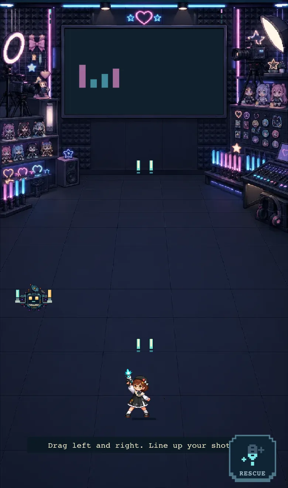

# Xuhuan: Only One Online

**Turn enemies into fans. Bring the music back.** A 90-second browser shooter. No signup.

[Play now](https://xuhuan-miniapp.vercel.app/demo) · [How it is built](https://xuhuan-miniapp.vercel.app/engineering) · [Give feedback](https://github.com/achenachena/xuhuan/issues/new)

<a href="https://xuhuan-miniapp.vercel.app/engineering"></a>

Aim at the glowing core: its bullets turn into support, the defeated machine becomes a cheering ally, and the music gains another layer. Choose a weapon, face the Boss, then save your battle card or try another run. Drag horizontally on phone or use drag/A/D/arrow keys on desktop; firing is automatic.

The anonymous demo runs locally without a player account or saved progress. [Telegram](https://t.me/xuhuangamebot) provides the full persistent campaign after server verification of Mini App `initData`.

## Engineering evidence

- **Retry-safe progress:** a real HTTP/PostgreSQL experiment loses a response after commit, retries without double-applying, then recovers from a stale version. [Reproduce it](docs/engineering-evidence.md) · [Recorded output](docs/evidence/retry-transcript.txt).
- **Measured hot-path optimization:** deterministic collision comparison, warmup and seven timed trials. [Benchmark](scripts/benchmark-collision.mjs) · [Measurements and limits](docs/evidence/collision-benchmark.txt).
- **Production ownership:** Go, PostgreSQL, Canvas, OpenAPI contracts, CI, AWS Lambda, Vercel and Terraform. The [engineering page](https://xuhuan-miniapp.vercel.app/engineering) explains the boundaries and trade-offs.

Independent player testing is still pending. [Playtest kit](docs/playtest-kit.md) · [Promotion drafts](docs/promotion-kit.md). Automated tests are not engagement evidence.

The V4 campaign is deliberately easy to enter: move only left and right, fire straight upward automatically, collect friendly support notes, and tap one special when it is ready. Each chapter contains three short waves, a concrete two-choice aftershow intermission, and a three-stage boss. Seven character chapters unlock the ensemble finale, **Zero Channel**. The post-campaign **Daily Aftershow** offers one deterministic wave, one show choice, and one boss with a rotating character and UTC seed.

## Why it fits Telegram

- Portrait play with one finger and no virtual joystick.
- The character stays on a fixed vertical line and follows the finger horizontally without inertia.
- Automatic fire keeps attention on dodging, support-note routes, and special timing.
- Three hearts, strong attack telegraphs, short waves, and one obvious special keep the first session readable.
- A room submits one bounded completion result when it ends; normal play sends no frame-by-frame requests.
- Closing Telegram restarts only the current room from its stored seed. PostgreSQL remains authoritative for durable progress.

## V4 content

V4 uses content version `v4` and simulation protocol `shooter-v1`.

| Content | Included |
| --- | ---: |
| Character chapters | 7 |
| Ensemble finales | 1 |
| Normal combat waves | 24 |
| Boss rooms | 8 |
| Total combat rooms | 32 |
| Boss stages | 24 |
| Shared show effects | 12 |
| Playable character specials | 7 |
| Unlockable companions | 7 |
| Composable enemy chassis | 6 |
| Finale endings | 3 |
| Locales | English and Simplified Chinese |

English is the default. The language can be changed at any time and is remembered on the device. Story decisions are concrete revisions such as sealing Nana's withdrawn voice note, restoring Xiangwan's funniest loss, or cancelling Bella's overnight shifts; V4 does not use hidden Trust, Authenticity, or Retention scores.

Read [game-design.md](docs/game-design.md) for the player loop and complete chapter table. Read [content-authoring.md](docs/content-authoring.md) before changing the embedded catalog.

## Architecture

```text
Telegram Mini App
  -> Next.js / React / Canvas 2D on Vercel
      -> HTTPS JSON + raw Telegram initData
          -> Go / Chi on an arm64 AWS Lambda Function URL
              -> Neon PostgreSQL: authoritative player and game state
              -> Upstash Redis: disposable rate-limit counters only
```

The browser runs a fixed 30 Hz simulation for immediate input and rendering. At the end of a room it sends a bounded result containing win state, remaining hearts, and score. This is an intentional single-player trade-off: the game has no economy or global leaderboard, so frame-by-frame server replay would add more parity risk than useful protection. Go still owns legal phase transitions, reward selection, story choices, unlocks, and durable progression. A command uses an idempotency key and expected Run version so retries cannot apply a completed room twice.

Production identity is exclusively Telegram Mini App `initData`. The repository intentionally contains no paid authentication provider, JWT or cookie session system, payment integration, share-token table, or second identity service. See [architecture.md](docs/architecture.md) for trust boundaries and ownership.

## Repository layout

```text
apps/api/                         Go API, progression rules, content, migrations
apps/api/internal/content/v4/     Immutable V4 content and locales
apps/miniapp/                     Next.js Mini App and local V4 assets
docs/                             Design, architecture, authoring, and operations
infra/terraform/                  Lambda, IAM, SSM, and operational alarms
scripts/                          Content, asset, and source-policy checks
```

## Run locally

Prerequisites: Docker Compose v2, Node.js 20+, npm 10+, and the Go toolchain selected by `apps/api/go.mod`. Compose runs only the local PostgreSQL and Redis dependencies; the application processes run directly on the host.

```sh
cp env.example .env
npm ci
make db-up
make migrate
```

Start the API and Mini App in separate terminals:

```sh
make api
make miniapp
```

Open `http://localhost:3000` or `/demo` to play immediately. The full campaign is mounted only when the Telegram SDK supplies `initData`. Playwright supplies an isolated Telegram host and API fixture; it does not create a development login or public credential.

Both public routes run `demo-v3`: an authored wave capped at 40 seconds, one visible weapon choice, and a Boss lasting at most 45 seconds. Clearing the final formation advances early; Rescue is never required to continue. Broken control cores turn their own formation's bullets into support; defeated machines become temporary penlight-waving allies. Each reversal restores another layer of the original local chiptune score. These demo-specific combat mechanics do not replace the eight-chapter campaign. Generate its static manifests from the Go catalog after relevant shooter or content changes:

```sh
npm run generate:portfolio-demo
npm run check:portfolio-demo
```

See [browser-demo.md](docs/browser-demo.md) for its scope and assets. The owner authorized production release; the independent human playtest remains pending. Automated tests verify correctness, not whether unfamiliar players find the game fun.

## Verify a change

```sh
npm run check:english-source
npm run check:content-assets
make test
make test-integration
make e2e
```

After changing the OpenAPI contract, regenerate and verify frontend types:

```sh
npm run generate:api-types --workspace @xuhuan/miniapp
npm run check:api-types --workspace @xuhuan/miniapp
```

The V4 loader and CI reject missing chapters, boss stages, translations, referenced assets, invalid behavior IDs, unreachable references, or entity limits that exceed the mobile runtime contract.

## Production release

Merging does not silently publish production. The protected workflow builds one explicit current `main` commit, publishes an immutable Lambda version, deploys the Vercel artifact, and checks API health, content, public entry, and demo routes. Database migrations run separately only when a release actually changes schema. See [production-release.md](docs/production-release.md).

Runtime secrets stay in AWS SSM `SecureString` parameters. GitHub uses short-lived AWS OIDC credentials; Vercel deployment uses the existing scoped deployment credential. These are deployment requirements, not player accounts or game tokens.

## Cost and scope

The production design has no VPC, NAT Gateway, API Gateway, load balancer, RDS, ElastiCache, container cluster, queue, paid observability service, payment provider, or paid identity provider. Neon holds authoritative PostgreSQL state. Upstash is used only for fail-open distributed rate limiting. Static V4 WebP assets ship with the Mini App.

## Fan-work notice

This is a non-commercial, unofficial fan project and technical portfolio demonstration. It is not affiliated with or endorsed by any character, group, platform, or rights holder. The plot, dialogue, enemies, backgrounds, systems, and V4 aftershow situations are original fiction; they make no factual claims about real people. Character names and likenesses remain the property of their respective rights holders and can be removed upon a valid request.

See [fan-reference-sources.md](docs/fan-reference-sources.md) for the deliberately conservative reference policy used by the V4 story.
